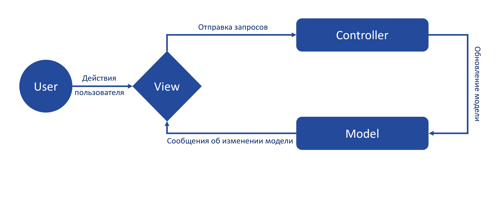
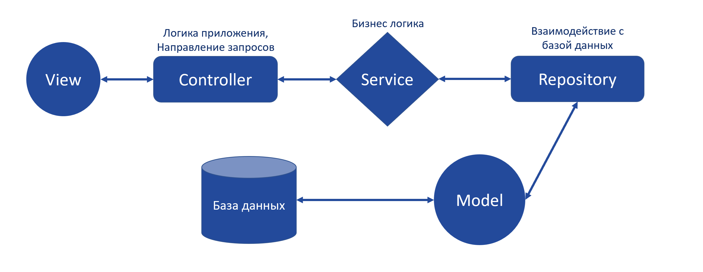
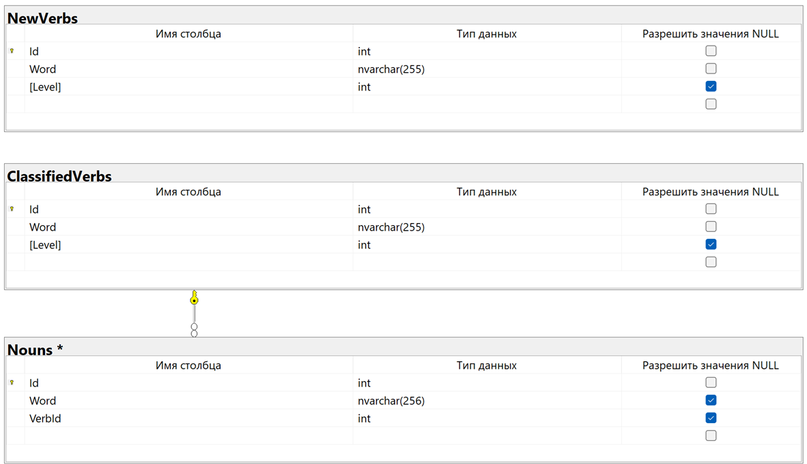
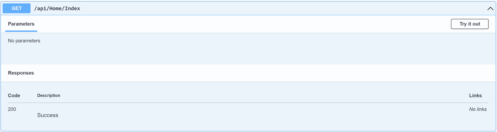
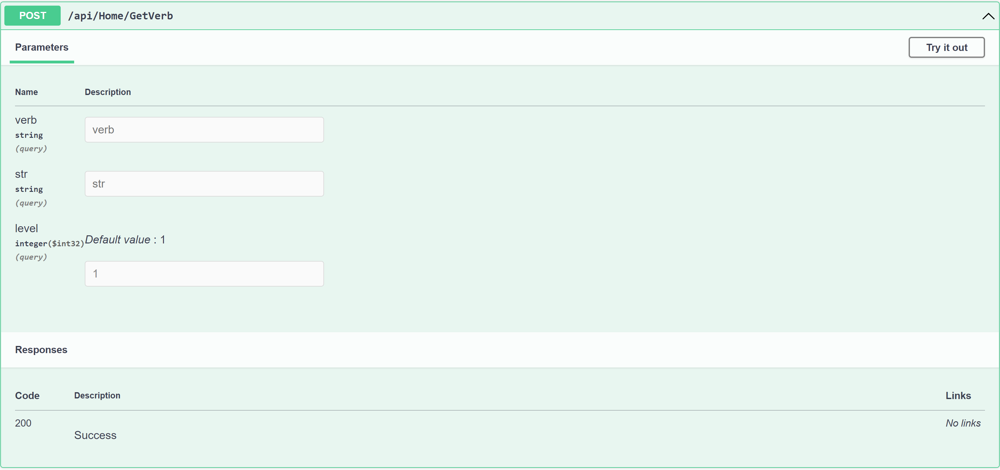
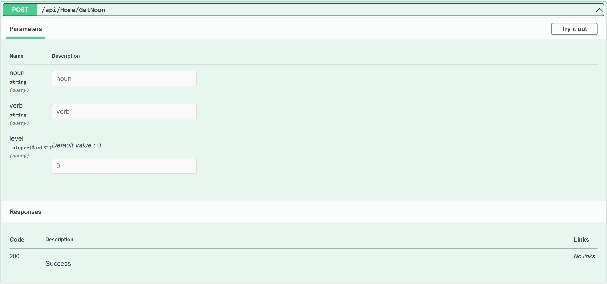
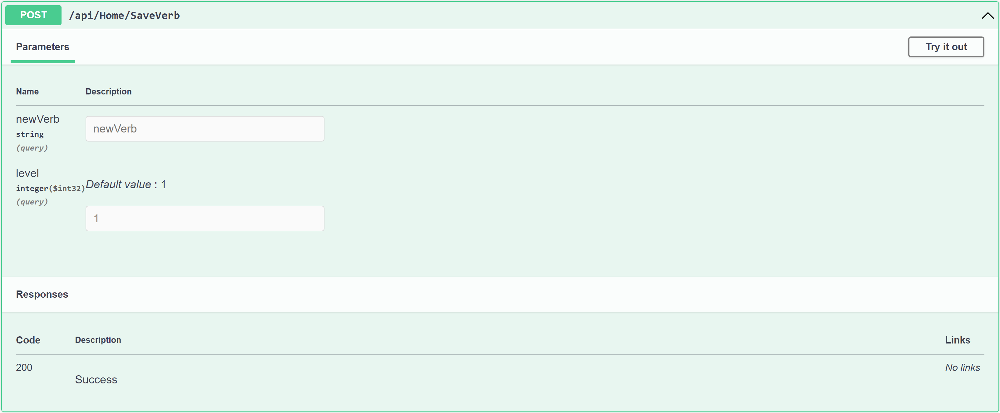

## Примечания:
> БД, написанная на t-sql лежит - [тут](https://github.com/Raaazzy/Content-analysis-of-EOC-2.0/blob/main/EOC_2_0.bacpac) <br>
Проект лежит - [тут](https://github.com/Raaazzy/Content-analysis-of-EOC-2.0/tree/main/EOC_2_0)

Чтобы запустить Swagger необходимо <b>раскомментировать</b> в Controllers/HomeController строки и произвести запуск `IIS Express`:
```C#
15. [Route("api/[controller]/[action]")]
16. [ApiController]
```

Чтобы запустить проект необходимо <b>закомментировать</b> в Controllers/HomeController строки и произвести запуск `EOC_2_0`:
```C#
15. [Route("api/[controller]/[action]")]
16. [ApiController]
```

## Архитектура веб-приложения: 


## Схема работы веб-приложения: 


## Схема БД:


## Swagger:

В веб-приложении только один контроллер "Home", в котором присутствуют следующие методы (actions): 

#### 1. Index()
Данный контроллер предназначен для инициализации списка глаголов и существительных на главной странице.

Не принимает никаких парамметров.

Проверяет возможно ли считать с БД глаголы и существительные:
- если нет, то перенасправляет на страницу ERROR;
- если да, то инициализирует списки глаголов и существительных для главной страницы.



#### 2. GetVerb(string verb, string str, int level)

Данный контроллер предназначен для вывода отфильтрованного списка глаголов (по уровню глагола и по уже написанным символам).

Принимаемые параметры:
- `verb` - первое слово в строке;<br>
  По правилам заполнения ПУД предполагается, что первое слово в предложении должно быть глаголом. Если же пользователь ввел слово или часть слова, которого нет в БД, то на странице выводится соответствующее предупреждение. 
- `str` - вся строка, которую заполнил пользователь;<br>
  Полная строка необходима для определения случая, когда после глагола установлен пробел. В таком случае необходимо вывести пустой список, поскольку подразумевается, что пользователь уже выбрал необходимый глагол. <br><br> Без проверки данного случая программа выводит список глаголов, состоящий из введенного слова + список предлагаемых существительных.
- `level` - уровень глагола по таксономии Блума (по совместительству номер заполняемого input-а во View пользователем).<br>
  Необходим для вывода глаголов конкретного уровня для определенного строки ввода.

Проверки осуществляемые данным контроллером:
- Если первое слово введено и строка заканчивается на пробел, то возвращает страницу с пустым списком глаголов и уровень глаголов, с которым производилась работа;
    - Если возникли ошибки при работе с БД, то возвращается ERROR страница.
- Если введена часть первого слова или слово целиком, то возвращает страницу со списком глаголов, отфильтрованным по уровню и введенной регулярке, и с уровнем глаголов;
    - Если возникли ошибки при работе с БД, то возвращается ERROR страница.
- Иначе возвращает страницу со списком глаголов, отфильтрованным по уровню и с уровнем глаголов.
    - Если возникли ошибки при работе с БД, то возвращается ERROR страница.



#### 3. GetNoun(string noun, string verb, int level)

Данный контроллер предназначен для вывода отфильтрованного списка существительных (по уровню введенного глагола и по уже написанным символам).

Принимаемые параметры:
- `noun` - второе слово в строке;<br>
  Предполагается, что после глагола пользователь должен ввести существительное для составления корректного словосочетания. Если пользователь ввел глагол, существующий в БД, то ему предлагается список существительных, с которыми возможно употребить представленный глагол.
- `verb` - первое слово в строке;<br>
  По правилам заполнения ПУД предполагается, что первое слово в предложении должно быть глаголом. Если же пользователь ввел первое слово или часть первого слова, которого нет в БД, то на странице выводится соответствующее предупреждение - в таком случае список существительных будет пустым.
- `level` - уровень глагола по таксономии Блума (по совместительству номер заполняемого input-а во View пользователем).<br>
  В данном контроллере он необходим для поиска глаголов, введенного в качестве первого слова.

Краткое пояснение алгоритма контроллера: 
1. Произвожу поиск первого слова (глагола) в БД;
2. Если такой глагол с заданными парамметрами единственный, то запоминаю его Id в БД;
3. Формирую список существительных для данного глагола (у каждого глагола свой список существительных, с которыми его можно употреблять).

Проверки осуществляемые данным контроллером:
1. Работа с глаголами:
- Если по заданной регулярке находится более одного глагола или же не назодится вовсе, то возвращается страницу с пустым списком существительных и уровнем глагола;
- Если по заданной регулярке находится только один глагол, но он не совпадает с тем, что введено в строке, то возвращается страницу с пустым списком существительных и уровнем глагола;
- Иначе запоминаю Id найденного глагола.
    - Если возникли проблемы при работе с БД, то возвращается ERROR страница.
2. Работа с существительными:
- Если значение string существительного пуст, то возвращается список всех существительных с данным verbId;
- Иначе возвращается список существительных с данным verbId и подходящий по заданной регулярке.
    - Если возникли проблемы при работе с БД, то возвращается ERROR страница.



#### 4. SaveVerb(string newVerb, int level)

Данный контроллер предназначен для сохранение глаголов, введенных пользователем и ранее не существовавших в БД.

Принимаемые параметры:
- `newVerb` - первое слово в строке(глагол); <br>
  По правилам заполнения ПУД предполагается, что первое слово в предложении должно быть глаголом.
- `level` - уровень глагола по таксономии Блума.<br>
  Уровень глагола тоже нужно сохранить в БД.

Проверки осуществляемые данным контроллером:
- Если значение глагола не null, то продолжаем работу;
- Если по заданной регулярке слова и с данным уровнем глагол не находится в БД, то сохраняем его в БД.
    - Если возникли проблемы при работе с БД, то возвращается ERROR страница.


